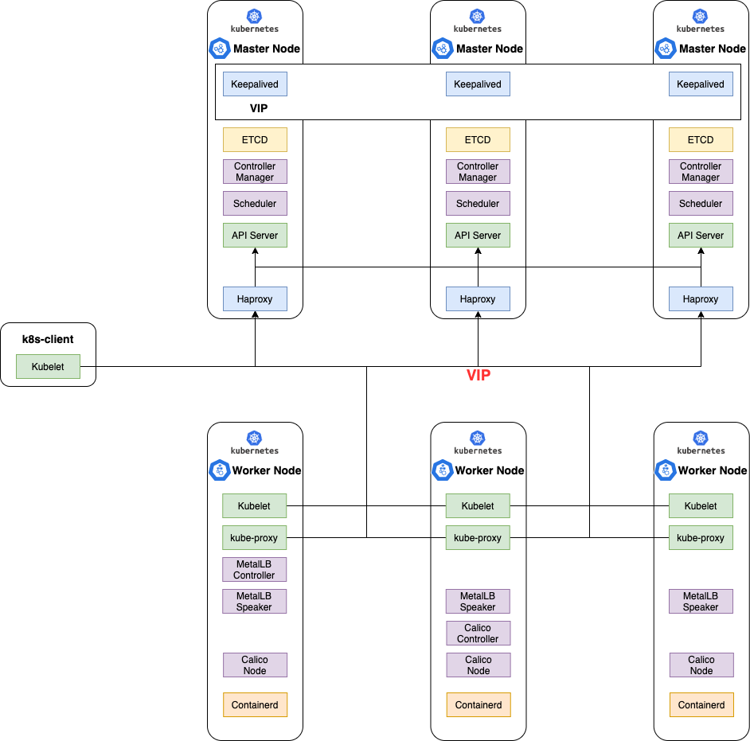

# Kubernetes The Hard Way Onprem

이 가이드는 [Kelsey Hightower](https://github.com/kelseyhightower/kubernetes-the-hard-way)가 작성한 GCP에서의 Kubetnetes Hardway를 On-premise 구성으로 테스트 해 볼 수 있는 수정 버전입니다.

## Copyright

라이센스는 원작자의 라이센스를 그대로 따릅니다.
 This work is licensed under a <a rel="license" href="http://creativecommons.org/licenses/by-nc-sa/4.0/">Creative Commons Attribution-NonCommercial-ShareAlike 4.0 International License</a>.

## Architecture

## Differences from kubernetes-the-hard-way by Kelsey Hightower 

* CNI는 Calico를 사용하였습니다.
* On-premise의 환경에서 사용하는 LoadBalancer는 MetalLB로 구성하였습니다.
* Kube-apiserver의 Endpoint 단일화를 위해 Master node에 Keepalived/Haproxy를 추가 구성하였습니다.

## Cluster Details

* [kubernetes](https://github.com/kubernetes/kubernetes) v1.18.6
* [containerd](https://github.com/containerd/containerd) v1.3.6
* [coredns](https://github.com/coredns/coredns) v1.7.0
* [cni](https://github.com/containernetworking/cni) v0.8.6
* [etcd](https://github.com/coreos/etcd) v3.4.10
* [calico](https://github.com/projectcalico/calico) v3.17

## Labs

테스트는 On-premise와 비슷하게 테스트하기 위해 가상머신에서 테스트를 진행하며, 가상머신은 Virtualbox를 사용하였습니다.

* [Prerequisites](docs/01-prerequisites.md)
* [Installing the Client Tools](docs/02-client-tools.md)
* [Provisioning Compute Resources](docs/03-compute-resources.md)
* [Provisioning the CA and Generating TLS Certificates](docs/04-certificate-authority.md)
* [Generating Kubernetes Configuration Files for Authentication](docs/05-kubernetes-configuration-files.md)
* [Generating the Data Encryption Config and Key](docs/06-data-encryption-keys.md)
* [Bootstrapping the etcd Cluster](docs/07-bootstrapping-etcd.md)
* [Bootstrapping the Kubernetes Control Plane](docs/08-bootstrapping-kubernetes-controllers.md)
* [Bootstrapping the Kubernetes Worker Nodes](docs/09-bootstrapping-kubernetes-workers.md)
* [Configuring kubectl for Remote Access](docs/10-configuring-kubectl.md)
* [Provisioning Pod Network Routes](docs/11-pod-network-routes.md)
* [Deploying the DNS Cluster Add-on](docs/12-dns-addon.md)
* [Smoke Test](docs/13-smoke-test.md)
* [Cleaning Up](docs/14-cleanup.md)

## 참고 사이트
* [Kubernetes The Hard Way](https://github.com/kelseyhightower/kubernetes-the-hard-way)
* [kubernetes-the-hard-way-modified](https://github.com/jmyung/kubernetes-the-hard-way-modified)